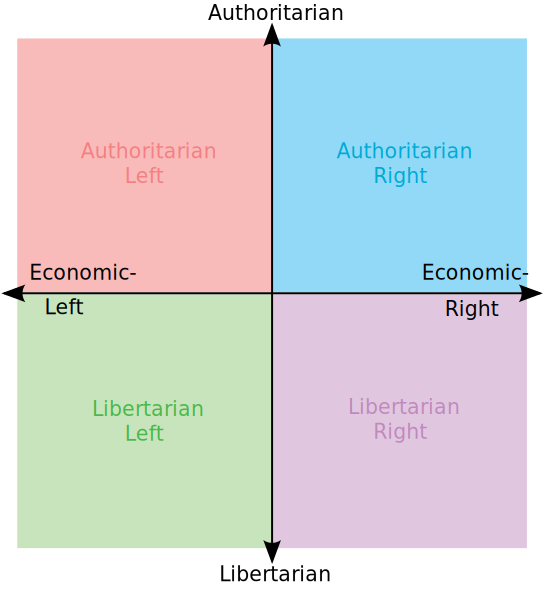
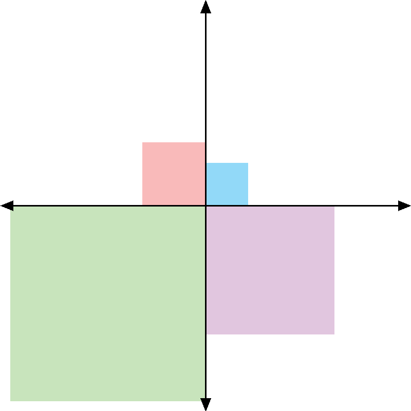

# r/PoliticalCompassMemes User Flair Representation
The integration of politics into social media has been thrust into the spotlight in recent years. However, it is sometimes difficult to tell with any certainty the political leaning of an online community. R/PoliticalCompassMemes on Reddit is one of the few online communities that allows users to self identify with a political ideology and have that leaning displayed on each comment they post. The subreddit revolves around ironic images of the "political compass" formulated by Pace News Limited. Here is an example blank political compass:

\
Even though typically the posts appear to poke fun at all sides fairly evenly, many users think that the subreddit has a hidden lean. In an attempt to investigate this underlying political leaning of the subreddit, I scraped all of the comments off of the top 1000 posts of all time. Then, I compiled a list of unique users and their "flairs" (the labels that self-identify their political ideology), and calculated the frequency of each. For users that fell direcly on the line between two quadrants, I counted them towards the total of each quadrant with a weight of 50%. In order to visualize the flair data in an attractive and accessible way, I drew a political compass with the size of each quadrant representing their representation on the subreddit.

\
As you can see, libertarian views heavily overshadow authoritarian views, with left libertarianism even more represented than right libertarianism. These findings undoubtably confirm a bias on the subreddit, but suprising this bias is more towards libertarian ideas than the left or right. One thing this project does not take into account, however, is the fact that these ideas exist on a spectrum. Each quadrant encompasses an incredibly wide range of views, from close to centrism to the extremes of each side. This project could be made better if there was a dataset available that presented each user's actual position on the Political Compass, rather than just the quadrant.
